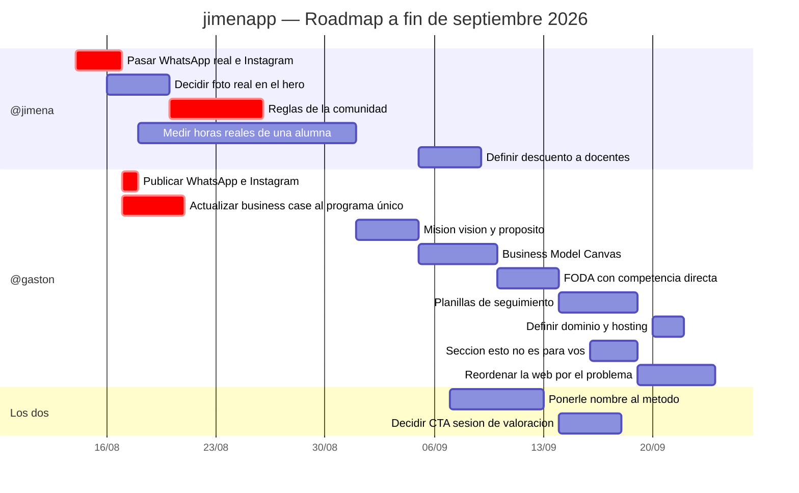

# Gantt por owner

> Vista de planificación del proyecto. Los pendientes salen de `memory.md`, que sigue siendo la fuente de verdad: si algo de acá lo contradice, gana `memory.md`.
>
> ⚠️ **Las fechas y los owners son una propuesta de Gastón, no un acuerdo cerrado entre los dos.** `memory.md` nunca tuvo owners asignados, así que esta división está inferida por el tipo de tarea. Jimena: corregí lo que no te cierre, es para eso.
>
> Última actualización: 13/08/2026.

## Por qué este orden

1. **Primero lo que desbloquea captación.** Hoy la web no puede convertir una sola visita: el WhatsApp es un número de ejemplo y el Instagram no tiene link. Todo lo demás optimiza un embudo que está cortado.
2. **La comunidad es urgente por riesgo, no por valor.** Ya se promociona como feature 06 del programa en el sitio en vivo, y operativamente no existe. Hay que resolverlo antes de que alguien se anote esperando algo que todavía no está.
3. **El business case bloquea las decisiones de precio.** Está escrito sobre los tres planes que ya no existen, así que sus conclusiones de rentabilidad quedaron desactualizadas. Y su hallazgo central es que el techo del negocio lo fija el precio.
4. **Las horas reales tardan.** Medir una alumna durante un mes no se acelera. Conviene arrancar temprano aunque el resultado se use tarde.
5. **Misión, visión, BMC y FODA van en cadena**, y recién ahora tienen sentido: dependían del posicionamiento, que se cerró el 12/08.

## Tabla de control

| Owner | Tarea | Estado | Bloquea a |
|---|---|---|---|
| @jimena | WhatsApp real e Instagram | 🔴 Pendiente | Toda la captación |
| @jimena | Reglas de la comunidad | 🔴 Pendiente | Feature 06 ya publicada |
| @jimena | Foto real en el hero | 🟡 Pendiente | — |
| @jimena | Horas reales de una alumna | 🟡 Pendiente | Sostener USD 35/mes |
| @jimena | Descuento a docentes | 🟢 Idea sin definir | — |
| @gaston | Business case al programa único | 🔴 Pendiente | Decisiones de precio |
| @gaston | Publicar WhatsApp e Instagram | ⏸️ Bloqueada por @jimena | — |
| @gaston | Misión, visión y propósito | 🟡 Pendiente | BMC |
| @gaston | Business Model Canvas | 🟡 Pendiente | FODA |
| @gaston | FODA con competencia | 🟡 Pendiente | — |
| @gaston | Planillas de seguimiento | 🟢 Pendiente | Argumento de venta |
| @gaston | Dominio y hosting | 🟢 Pendiente | — |
| @gaston | Sección "esto no es para vos" | 🟢 Idea del benchmark | — |
| @gaston | Reordenar la web por el problema | 🟢 Idea del benchmark | — |
| Los dos | Nombre del método | 🟡 Pendiente | Sostener precio |
| Los dos | CTA de sesión de valoración | 🟢 Idea del benchmark | — |

## Cerradas en los últimos días

Posicionamiento hormonal (12/08) · Precio único USD 35/mes (13/08) · Programa único en reemplazo de los tres planes (13/08) · Hero reescrito con el copy de Jimena (12/08) · "Sobre mí" con su historia real (13/08) · Foto real de Jimena (13/08) · Video de alumnas en el hero (13/08) · Primeros testimonios reales, Silvia y Verónica (13/08).
