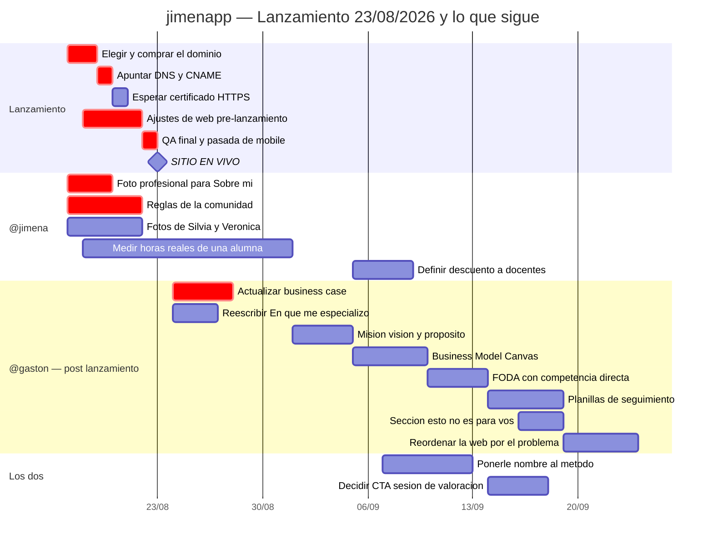

# Gantt por owner

> Vista de planificación del proyecto. Los pendientes salen de `memory.md`, que sigue siendo la fuente de verdad: si algo de acá lo contradice, gana `memory.md`. La vista complementaria, agrupada por área en vez de por owner, es `backlog.md`.
>
> ⚠️ **Los owners y las fechas de después del lanzamiento son una propuesta de Gastón, no un acuerdo cerrado entre los dos.** Jimena: corregí lo que no te cierre, es para eso. Lo que sí está cerrado es la fecha de lanzamiento.
>
> Última actualización: 17/08/2026.

## El hito que ordena todo: 23/08/2026

**El sitio tiene que estar en vivo bajo un dominio propio el 23 de agosto.** Decisión de Gastón del 17/08/2026. Antes de esa fecha entra solo lo que bloquea publicar; todo lo demás es post-lanzamiento, aunque estuviera antes en la lista.

El criterio para decidir de qué lado cae cada tarea es uno solo: **¿esto hace que la página no se pueda mostrar, o solo que se pueda mostrar mejor?** Lo segundo puede salir el 24 sin que pase nada — el sitio se publica desde `main/docs` y cada push está en vivo un minuto después, así que después del lanzamiento se sigue mejorando sobre la página viva.

## Por qué este orden

1. **El dominio va primero y no puede esperar al 22.** Es la única tarea de la semana con un tiempo de espera que no depende de nadie: después de apuntar el DNS, GitHub Pages tarda **hasta 24 horas** en emitir el certificado HTTPS. Comprarlo el 22 significa lanzar el 23 sin candado en el navegador, que en una página que pide escribir por WhatsApp es exactamente el tipo de detalle que hace dudar a una clienta. Comprado el 18-19, sobra margen.
2. **Los ajustes de web van en paralelo, no después.** No dependen del dominio: se trabaja sobre `docs/index.html` igual que hasta ahora y el dominio solo cambia por dónde se entra.
3. **La foto de Jimena es lo más urgente del lado de ella.** Es lo único pendiente que se ve en la primera pantalla de scroll y que ninguna cantidad de CSS puede arreglar — ya está diagnosticado en `memory.md`. Si no llega para el 21, se lanza con la actual y se cambia después; no vale correr la fecha por eso.
4. **La comunidad sigue siendo el riesgo real del lanzamiento.** Se promociona como feature 06 del programa, y lanzar con dominio propio significa empezar a mandar tráfico de verdad a esa promesa. Es la única tarea de la semana que no es cosmética: es algo ofrecido que todavía no existe.
5. **El business case se corre al 24.** Estaba para el 17, pero no bloquea publicar — el precio ya está decidido y puesto en el sitio. Lo que el business case revisa es si ese precio *conviene*, y esa conversación se puede dar con la página ya en vivo. Además su cierre fino depende de las horas reales por alumna, que se están midiendo recién.
6. **Misión, visión, BMC y FODA van en cadena** y dependían del posicionamiento, que se cerró el 12/08.

## Tabla de control

### Antes del 23/08 — bloquea el lanzamiento

| Owner | Tarea | Estado |
|---|---|---|
| @gaston | Elegir, comprar y apuntar el dominio | 🔴 Sin arrancar |
| @gaston | Ajustes de web pre-lanzamiento | 🔴 A definir cuáles |
| @gaston | QA final y pasada de mobile | 🔴 Sin arrancar |
| @jimena | Foto profesional para "Sobre mí" | 🔴 Pendiente |
| @jimena | Reglas de la comunidad | 🔴 Pendiente — feature ya publicada |
| @jimena | Fotos de Silvia y Verónica | 🟡 Deseable, no bloquea |

### Después del 23/08

| Owner | Tarea | Estado | Bloquea a |
|---|---|---|---|
| @gaston | Business case al programa único | 🔴 Pendiente | Decisiones de precio |
| @gaston | Reescribir "En qué me especializo" | 🟡 Pendiente | — |
| @gaston | Misión, visión y propósito | 🟡 Pendiente | BMC |
| @gaston | Business Model Canvas | 🟡 Pendiente | FODA |
| @gaston | FODA con competencia | 🟡 Pendiente | — |
| @gaston | Planillas de seguimiento | 🟢 Pendiente | Argumento de venta |
| @gaston | Sección "esto no es para vos" | 🟢 Idea del benchmark | — |
| @gaston | Reordenar la web por el problema | 🟢 Idea del benchmark | — |
| @jimena | Horas reales de una alumna | 🟡 En curso | Sostener USD 35/mes |
| @jimena | Descuento a docentes | 🟢 Idea sin definir | — |
| Los dos | Nombre del método | 🟡 Pendiente | Sostener precio |
| Los dos | CTA de sesión de valoración | 🟢 Idea del benchmark | — |

## Cerradas en los últimos días

**15/08:** WhatsApp e Instagram reales publicados (cierra los dos bloqueantes de captación) · animación del claim del hero, en dos pasos · "Sobre mí" reacomodada · contraste y ritmo del sitio, con "Cómo trabajo" como única sección oscura · el bug de que las animaciones de scroll nunca llegaban a verse · pasada completa de mobile, cinco bugs.

**14/08:** benchmark world class de 18 sitios · eyebrows sacados · bug del menú hamburguesa entre 401 y 720px.

**12-13/08:** posicionamiento hormonal · precio único USD 35/mes · programa único en reemplazo de los tres planes · hero reescrito · "Sobre mí" con la historia real · video de alumnas en el hero · primeros testimonios reales.
